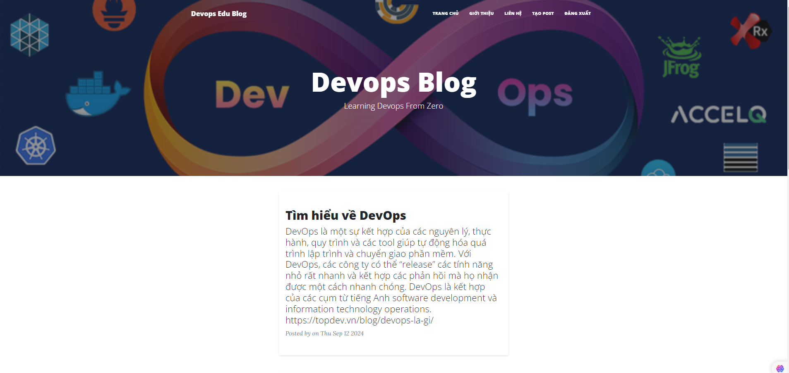

# [Nghiêm Xuân Đạt - Post Blog]
Đây là 1 blog về các bài viết xoay quanh DevOps, bao gồm các Function:
1. Đăng nhập / Đăng xuất
2. Tạo bài viết
3. Xem bài viết 
4. Giới thiệu

Bên cạnh đó, project có code các middleware authen,validation, session
Dùng nodemon để start dự án, connect đến MongoDB server
Database: my_database
Collection: Import các file data có sẵn vào db
Đăng nhập:
 user: datnx 
 password: 123456

#### npm Scripts

* `npm start` or `npm run start` : khởi chạy dự án

You must have npm installed in order to use this build environment.

